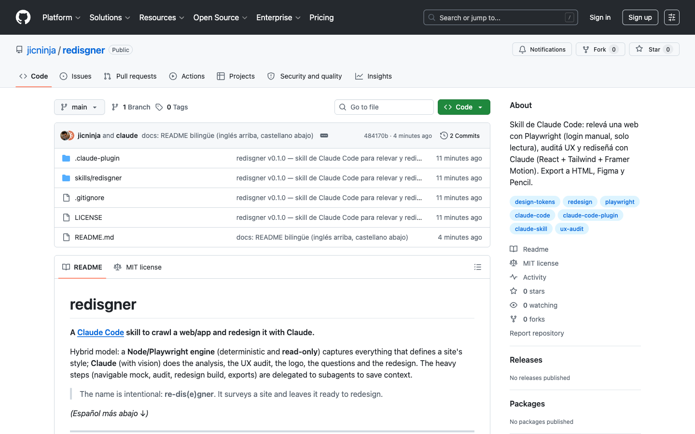
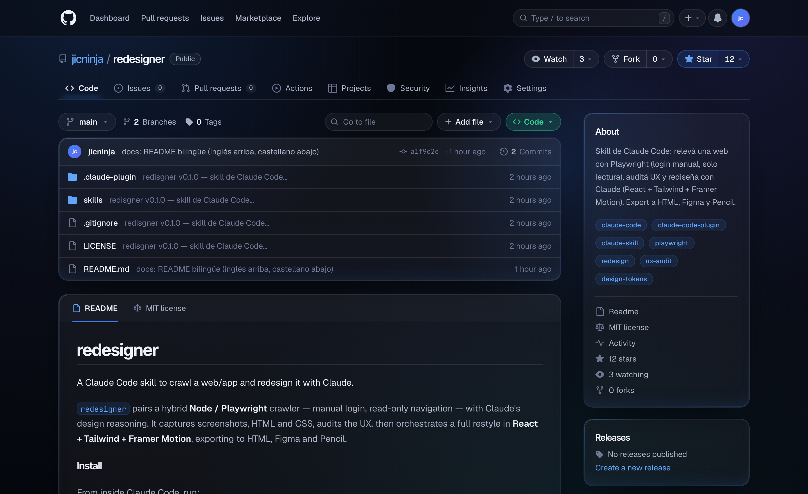
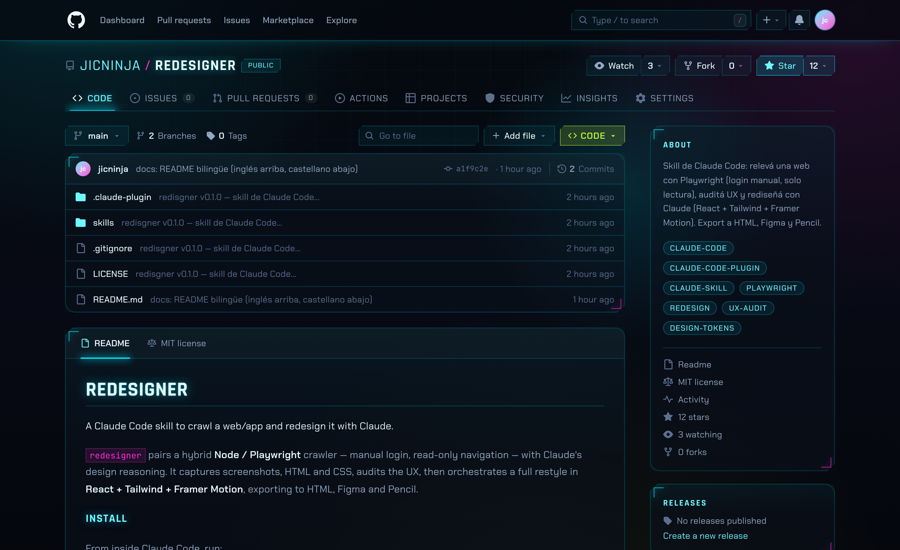

# redesigner

**A [Claude Code](https://claude.com/claude-code) skill to crawl a web/app and redesign it with Claude.**

Hybrid model: a **Node/Playwright engine** (deterministic and **read-only**) captures everything that defines a site's style; **Claude** (with vision) does the analysis, the UX audit, the logo, the questions and the redesign. The heavy steps (navigable mock, audit, redesign build, exports) are delegated to subagents to save context.

> Point it at any site — it surveys the style, then rebuilds it with Claude.

*(Español más abajo ↓)*

---

## Install

It's a Claude Code plugin. From Claude Code:

```text
/plugin marketplace add jicninja/redesigner
/plugin install redesigner@redesigner
```

**Requirements:** Node ≥ 20 and npm. On the **first run**, the skill installs its dependencies and downloads Playwright's Chromium automatically (`npm install` + `postinstall`).

Then just ask Claude:

```text
redesign this site: https://app.example.com
```

or *"survey the style of …"*, *"scrape this site"*, *"redesigner …"*.

---

## Example — redesigning its own repo page

redesigner was pointed at **its own GitHub repo page** and asked to redesign it — **twice, in two very different styles**. Both keep the exact same page (repo header, tabs, file list, README panel, About sidebar) and only swap the skin.

**Before** — the plain GitHub repo page:



**After ① — dark glassmorphism** · 🔗 **[redesigner-glass.surge.sh](https://redesigner-glass.surge.sh)**
Frosted translucent panels with `backdrop-blur`, a soft ambient blue glow and a single brand accent (`#3b82f6`).



**After ② — cyberpunk / neon** · 🔗 **[redesigner-cyber.surge.sh](https://redesigner-cyber.surge.sh)**
Neon cyan + magenta on near-black, glowing borders, HUD corner brackets, CRT scanlines, angular clipped chrome and glitch micro-interactions.



*Same structure and content, two full re-skins — change only the design tokens. Produced end to end with redesigner (capture → analysis → Claude design with Tailwind v4 + Framer Motion), then deployed to Surge.*

---

## How it works (pipeline)

1. **Capture** (Playwright, read-only) — crawls same-origin **without touching anything destructive** (skips logout/delete/checkout/…), and per page saves: screenshots (full + viewport), HTML, CSS (via network interception, CORS-immune), sampled computed styles, hovers/focus (pixels + diff), `transitions` and `@keyframes`. Detects the **logo** and aggregates **design tokens**.
2. **preview.html** — lightweight gallery to eyeball what was scraped, without spending model context.
3. **Navigable mock** (subagent) — recreates the surveyed site view by view, so you can walk through it before deciding.
4. **Analysis** (Claude) — reports in `reports/`: overview, visual style, design tokens, logo.
5. **UX audit** (subagent, senior designer role) — Nielsen heuristics, hierarchy, consistency, accessibility/contrast, states, and quick wins vs opportunities.
6. **Logo** — if it's generic, it builds a **prompt for gpt-image** that you run yourself (no API, no cost).
7. **Claude design** (subagent with the `frontend-design` skill) — scaffolds **React 19 + Vite + Tailwind v4 + Framer Motion** seeded with the tokens, and Claude fills in components and pages.
8. **Show + iterate** — mandatory gate: the redesign is shown and iterated by prompt **until you approve**, before exporting.
9. **Exports** (subagent, optional, only after approval) — static HTML mock, **Figma** (`html.to.design` + `tokens.figma.json` for Tokens Studio) and **Pencil** (.pen via MCP).

`redesign/` (the React project) is the **source of truth** for exports.

---

## Security

- **MANUAL login, no credentials.** The engine **never** receives or asks for a username/password. If the site has a login, a Chromium window opens (`--no-headless`) and **you log in by hand**; the engine detects on its own when you're in and continues. There are no credential flags or env vars — by design.
- **Read-only.** The crawler does not delete, edit or submit forms (except the login you do yourself). It skips destructive links.
- Always use a **test account**, never a production one.
- Session cookies stay only in the local artifacts (`.auth/`, gitignored) — never published.

---

## Manual engine usage (optional)

Beyond the skill, the engine can be run by hand from `skills/redesigner/`:

```bash
cd skills/redesigner
npm install                 # first time (downloads Chromium)

# Survey (with a visible browser in case there's a manual login)
npm run capture -- --url https://example.com --out ./redesigner-artifacts --max-pages 25 --no-headless

# Scaffold the redesign (React) and, optionally, the HTML mock
npm run scaffold -- --out . --artifacts ./redesigner-artifacts
npm run scaffold -- --out . --artifacts ./redesigner-artifacts --target html
```

**`capture` flags:** `--url` (req.), `--login-url`, `--out`, `--max-pages`, `--viewport WxH`, `--no-headless`, `--capture-trace`, `--page-timeout <ms>`.
**`scaffold` flags:** `--out` (req.), `--artifacts`, `--target react|html`.

---

## Artifacts (`redesigner-artifacts/`)

```text
manifest.json   preview.html   tokens.json
screenshots/    html/          css/{computed,inline,transitions.json,animations.json,hover-states.json}
logo/{logo.png, candidates/, candidates.json}
reports/{site-overview, visual-style, design-tokens, logo-analysis, logo-prompt, redesign-brief, uiux-expert-review}.md
```

They are generated in the **project where you invoke** the skill, not in the plugin repo.

---

## Repo structure

```text
.claude-plugin/{plugin.json, marketplace.json}   ← marketplace + plugin
skills/redesigner/
  SKILL.md                                        ← orchestration (what Claude reads)
  package.json, bin/, src/                        ← Node/Playwright engine
```

## License

MIT — see [LICENSE](./LICENSE).

<br>

---
---

<br>

# redesigner (Español)

**Skill de [Claude Code](https://claude.com/claude-code) para relevar una web/app y rediseñarla con Claude.**

Modelo híbrido: un **motor Node/Playwright** (determinístico y de **solo lectura**) captura todo lo que define el estilo de un sitio; **Claude** (con visión) hace el análisis, la auditoría UX, el logo, las preguntas y el rediseño. Los pasos pesados (mock navegable, auditoría, build del rediseño, exports) se delegan a subagentes para no gastar contexto.

> Apuntalo a cualquier sitio — releva el estilo y lo reconstruye con Claude.

---

## Instalación

Es un plugin de Claude Code. Desde Claude Code:

```text
/plugin marketplace add jicninja/redesigner
/plugin install redesigner@redesigner
```

**Requisitos:** Node ≥ 20 y npm. En la **primera corrida**, el skill instala sus dependencias y baja Chromium de Playwright automáticamente (`npm install` + `postinstall`).

Después, simplemente pedíselo a Claude:

```text
rediseñá este sitio: https://app.ejemplo.com
```

o *"relevá el estilo de …"*, *"scrapeá este sitio"*, *"redesigner …"*.

---

## Ejemplo — rediseñando su propia página del repo

Apuntamos redesigner a **su propia página de GitHub** y le pedimos que la rediseñe — **dos veces, en dos estilos bien distintos**. Ambos mantienen exactamente la misma página (header del repo, tabs, lista de archivos, panel del README, sidebar About) y solo cambian la piel.

**Antes** — la página del repo en GitHub, pelada:


**Después ① — glassmorphism oscuro** · 🔗 **[redesigner-glass.surge.sh](https://redesigner-glass.surge.sh)**
Paneles de vidrio esmerilado translúcido con `backdrop-blur`, un glow azul ambiental suave y un único acento de marca (`#3b82f6`).


**Después ② — cyberpunk / neon** · 🔗 **[redesigner-cyber.surge.sh](https://redesigner-cyber.surge.sh)**
Neon cyan + magenta sobre negro, bordes con glow, corner-brackets tipo HUD, scanlines CRT, chrome angular recortado y micro-glitches.


*Misma estructura y contenido, dos reskins completos — cambian solo los design tokens. Hecho de punta a punta con redesigner (capture → análisis → Claude design con Tailwind v4 + Framer Motion) y deployado a Surge.*

---

## Cómo funciona (pipeline)

1. **Capture** (Playwright, solo lectura) — crawlea same-origin **sin tocar nada destructivo** (salta logout/delete/checkout/…), y por cada página guarda: screenshots (full + viewport), HTML, CSS (vía interceptación de red, inmune a CORS), computed styles muestreados, hovers/focus (píxeles + diff), `transitions` y `@keyframes`. Detecta el **logo** y agrega **design tokens**.
2. **preview.html** — galería liviana para revisar a ojo lo scrapeado, sin gastar contexto del modelo.
3. **Mock navegable** (subagente) — recrea el sitio relevado vista por vista, para que lo recorras antes de decidir.
4. **Análisis** (Claude) — reportes en `reports/`: overview, estilo visual, design tokens, logo.
5. **Auditoría UX** (subagente, rol de diseñador/a senior) — heurísticas de Nielsen, jerarquía, consistencia, accesibilidad/contraste, estados, y quick wins vs oportunidades.
6. **Logo** — si es genérico, arma un **prompt para gpt-image** que vos lanzás a mano (sin API ni costo).
7. **Claude design** (subagente con el skill `frontend-design`) — scaffold **React 19 + Vite + Tailwind v4 + Framer Motion** sembrado con los tokens, y Claude completa componentes y páginas.
8. **Mostrar + iterar** — gate obligatorio: se muestra el rediseño y se itera por prompt **hasta que apruebes**, antes de exportar.
9. **Exports** (subagente, opcional, solo tras aprobación) — mock HTML estático, **Figma** (`html.to.design` + `tokens.figma.json` para Tokens Studio) y **Pencil** (.pen vía MCP).

`redesign/` (proyecto React) es la **fuente de verdad** de los exports.

---

## Seguridad

- **Login MANUAL, sin credenciales.** El motor **nunca** recibe ni pide usuario/contraseña. Si el sitio tiene login, se abre una ventana de Chromium (`--no-headless`) y **logueás vos a mano**; el motor detecta solo cuando entraste y sigue. No hay flags ni env vars de credenciales — es intencional.
- **Solo lectura.** El crawler no borra, edita ni envía formularios (salvo el login que hacés vos). Salta links destructivos.
- Usá siempre una **cuenta de prueba**, nunca una productiva.
- Las cookies de sesión quedan solo en los artefactos locales (`.auth/`, gitignored) — nunca se publican.

---

## Uso manual del motor (opcional)

Más allá del skill, el motor se puede correr a mano desde `skills/redesigner/`:

```bash
cd skills/redesigner
npm install                 # primera vez (baja Chromium)

# Relevar (con navegador visible por si hay login manual)
npm run capture -- --url https://ejemplo.com --out ./redesigner-artifacts --max-pages 25 --no-headless

# Scaffold del rediseño (React) y, opcional, mock HTML
npm run scaffold -- --out . --artifacts ./redesigner-artifacts
npm run scaffold -- --out . --artifacts ./redesigner-artifacts --target html
```

**Flags de `capture`:** `--url` (req.), `--login-url`, `--out`, `--max-pages`, `--viewport WxH`, `--no-headless`, `--capture-trace`, `--page-timeout <ms>`.
**Flags de `scaffold`:** `--out` (req.), `--artifacts`, `--target react|html`.

---

## Artefactos (`redesigner-artifacts/`)

```text
manifest.json   preview.html   tokens.json
screenshots/    html/          css/{computed,inline,transitions.json,animations.json,hover-states.json}
logo/{logo.png, candidates/, candidates.json}
reports/{site-overview, visual-style, design-tokens, logo-analysis, logo-prompt, redesign-brief, uiux-expert-review}.md
```

Se generan en el **proyecto donde invocás** la skill, no en el repo del plugin.

---

## Estructura del repo

```text
.claude-plugin/{plugin.json, marketplace.json}   ← marketplace + plugin
skills/redesigner/
  SKILL.md                                        ← orquestación (lo que lee Claude)
  package.json, bin/, src/                        ← motor Node/Playwright
```

## Licencia

MIT — ver [LICENSE](./LICENSE).
